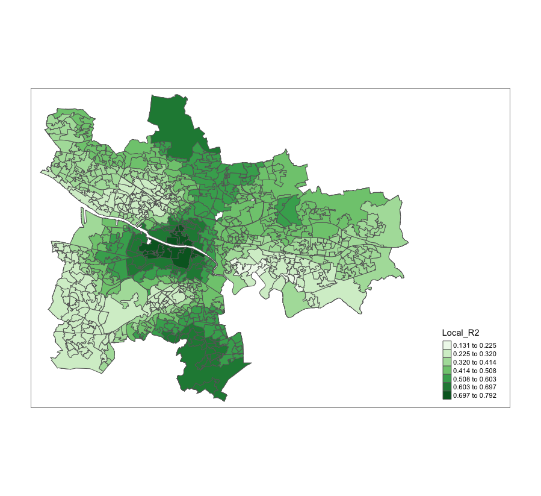

# GWR Analysis 
## A Study on Socioeconomic Variable and Noise Pollution in Glasgow, Scotland

### Introduction and Intent of Research: 
Scotland’s draft National Planning Framework 4 (NPF4) Integrated Impact Assessment identifies that deprived communities are more exposed to higher levels of noise than those in less deprived areas. The literature on noise levels and deprivation suggest that there is a higher likelihood of occurrence, but these results are extremely dependent on the local context of the study areas. Leiper and Hood (2023), in analysing the relationship between noise and deprivation in four Scottish cities (Glasgow, Edinburgh, Aberdeen, and Dundee) find that with the exception of Glasgow, there is no significant relationship between noise and the Scottish Index of Multiple Deprivation (SIMD). However, by comparing the relationship between noise and deprivation between Scottish cities, Leiper and Hood (2023) do not address how the relationship between noise and deprivation varies within these cities. This report aims to address this gap by assessing the spatially variant impact of noise from road traffic on deprivation indicators within Glasgow using a Geographically Weighted Regression (GWR) analysis. 

The sources of the data used are quite varied. The LDEN noise raster is published online here: 
https://www.data.gov.uk/dataset/c335ebaa-304a-427a-873b-4adc264e976b/noise-mapping-scotland-round-4-consolidated-all-sources-lden 

The socioeconomic data was gleaned from both SIMD and the 2011 Census. The final report describes where each variable was found, and the r script is annotated to describe how the data was defined and cleaned. 

Also uploaded into the repository is the map of the r-squared values for each datazone in Glasgow produced by the GWR analysis. This shows where SES has a high model fit with noise levels from traffic. 

